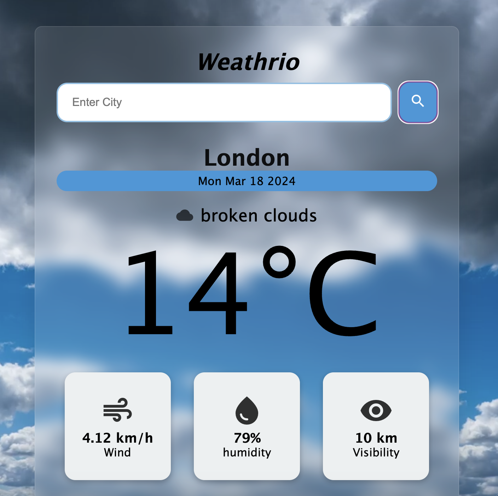
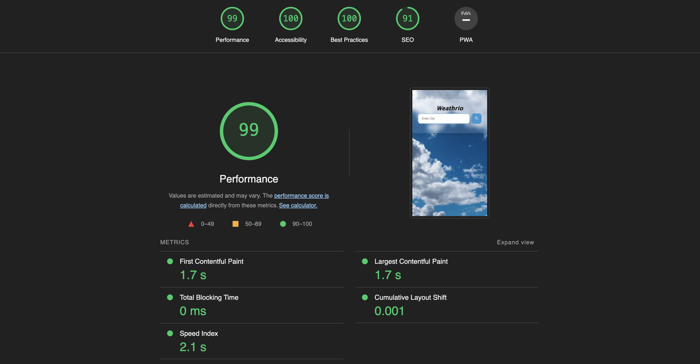

# Weathrio
Weathrio is a simple yet affective weather searching site that allows users to accumulate the weather data of cities around  the world.
This site helps users to know the time, temperature, wind speed, humidity and visibility of any cities. It is one of the easiest and reliable site to know the conditions of any cities.

## Features 
- Background Video
  - Upon opening the weathrio you will see a beautiful background video of a sunny/cloudy day.
- Search bar
  - This page contains a search bar which is presented in a transparent block where users  will be able to type and search any cities around the world.
   -Example
   
   Here is an example of the completed search where the page shows the data in a transparent block with readable font and different icon.
- Search Button
 - Beside the search bar is located a search button which is styled to match the background and front color scheme.
   Upon hovering your mouse over the seacrh button it will change the color to that of red to let users know that the button is clickable.

## Technologies Used
 -HTML5
 -CSS
 -Javascript

## The Header

  - The Header shows the name of the app, which is styled in a dark color to match the background video of the page.
  

## Testing 

- I tested that this site works in different browsers : Chrome, Safari.
- I confirmed that this page is responsive, looks good and functions on all standard screen sizes using the devtools device toolbar.
 
- I confirmed that the search bar, search button, are all functioning properly and properly placed.
I have confirmed that the form wokrs : requires user to type correct cities name in order to show the result. If the user types the cities name wrong or false the submission will not work and the page will be reloaded for new search input. 
### Validator Testing 

- HTML
  - 1 error has been found. As the page uses form element action attribute is left empty in order to submit the users input in a current page.
- CSS
  - No errors were found when passing through the official (Jigsaw) validator
- Javascript
  - Using JShint validator there are total of 29 warnings as of now 

- Unfixed Bugs
  - None

## Deployment
- The site was deployed to GitHub pages. The steps to deploy are as follows: 
  - In the GitHub repository, navigate to the Settings tab 
  - From the source section drop-down menu, select the Master Branch
  - Once the master branch has been selected, the page will be automatically refreshed with a detailed ribbon display to indicate the successful deployment. 

The live link can be found here - [Weathrio](https://grgmausham.github.io/Weather-App/)

## Credits 
 - For the idea of a weather app project I have used youtube tutorial of[Youtube](https://www.youtube.com/@codewithgulzar)
 

### Content 
- The icons for the app were taken from [Google](https://fonts.google.com/icons)

### Media

- - Background video is imported for [Mixkit](https://mixkit.co/)